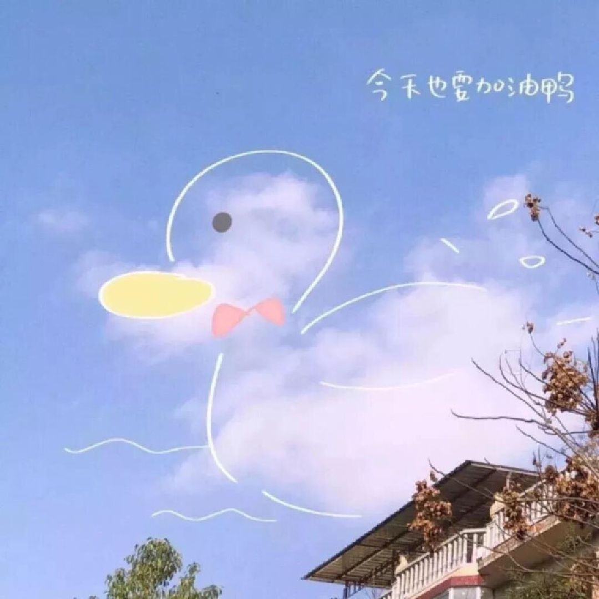

今天是2026年3月24日。我突然想明白了一些事情。  
  
今天下午关注到语雀导出pdf有问题，我就小红书去搜素，但是我并没有搜到我想要的答案。
但是我却搜到了语雀可能要倒闭的消息。对此，有两种声音，一种认为不太可能，或者说如果真的倒闭了，那么也一定会给出迁移措施的。
另外一种呢就是已经准备把语雀迁移出去了，但是又会引出新的问题，但不是我要表达的重点。  
  
我想明白了什么呢？  
  
就算文档真的丢了，最坏的结果是什么，就是之前记录的东西没了吧，但是呢，语雀这么多年了，如果我的没了，那么别人的肯定也会有影响的，因此我为什么要提前去焦虑呢。
此时就能看出这种提前担忧是无用的且没有意义的。  
  
然后呢，文档的价值是什么呢，丰富精神世界，可是如果你的生活因为学习或者其他杂事，因为社会内卷，大家都在卷，而导致你的生活一团糟，充满了疲惫和不开心。
那么这些努力又有什么真的价值呢，上课也不是真的去上课了，而是拼命去学东西，不是出于兴趣，更多的是自己去逼着自己努力，为的就是赚钱，但是一点也不开心。不止于语雀这一个东西。
如果这样子这会导致什么，你的精神世界是混乱的，你是不开心的，你并没有真的感觉到知识的价值，或者说，你没有把学习和生活有机结合安排好，而导致自己过的不好。  
之前云记也有过类似的想法，忙着去备份，就怕哪天丢了。  
但是你抽离出来想一想，文档这些完全就是身外之物，未来应该是靠着你的自己的处理问题的方法和稳定的内核去走到更高更远的地方去。
 
人终究是为了生活，生活的价值又是处于联系之中，联系又是为了合作和感受到集体的快乐。
  
因此，请先照顾好自己，照顾好自己的情绪，让自己真的享受在处理一些事务，处理一些问题，或者说处于一些经历的这些过程中去，而不要总是想着一些负面的，让自己心理疲劳的想法，
好好去体会校园生活、社会生活，提升一下自己的真正的本质所在——心理内核。  
  
接下来的人生，我们一起去好好体会过程呀！例如考研、考证、考公，我们可以去尝试，如果你不是完全排斥，但是呢，我们不要去过于功利，不要为了这些名利，削弱自己的日常生活的幸福指数。
这些经历应该是丰富我们的日常的，是让我们的生活更加美好的存在，锦上添花的历程，不是让我们天天叹气的存在。  
  
加油！每天都是充满美好期待的一天。

