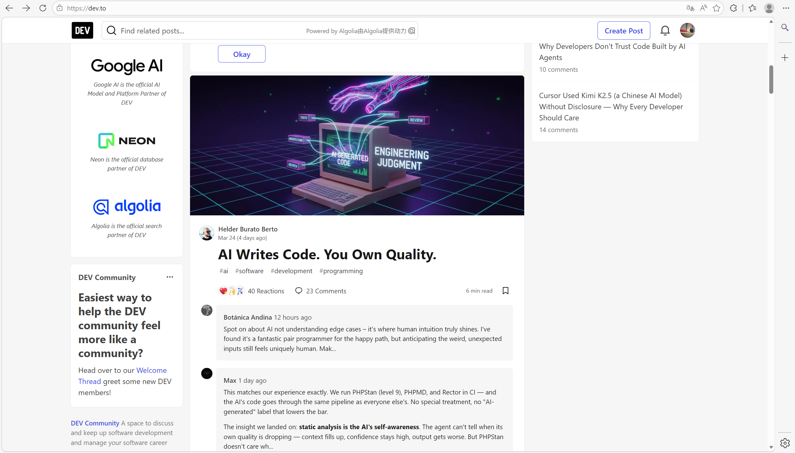

今天是2026年3月29日。今天尝试了一个新的英语学习方法，同时也能够陶冶情操，提升自己的内部素养，感受“外部”的环境。

简言之，就是去国外的博客网站逛一逛，半脱离国内应试学习英语的环境，抽离出来一些思维，去感受无形中英语水平的提升，同时也不会有过度的排斥感。

以下是我通过ai搜集到的一些网站，同时我也会在学习专刊新加一条，梳理出以下网站：

这类平台适合开发者或科技爱好者记录学习、分享观点。

| 平台               | 核心特点                                              | 适合人群            |
|:-----------------|:--------------------------------------------------|:----------------|
| **Medium**       | 泛科技内容社区，流量大，适合深度长文，有付费会员阅读机制。                     | 想获得广泛阅读量的写作者    |
| **Dev.to**       | 纯开发者社区，互动强，支持 RSS 导入，容易获得技术同行反馈。                  | 程序员、尤其是前端和全栈开发者 |
| **Hashnode**     | 开发者专属，支持绑定自定义域名，自带社区，兼顾个性化和曝光。                    | 想拥有个人品牌域名的开发者   |
| **Hacker Noon**  | 聚焦前沿技术（AI、区块链），文章常被媒体转载，编辑审核较严。                   | 写深度技术解析的资深从业者   |
| **Static Sites** | 使用 Hugo/Jekyll 等生成静态页，托管在 GitHub Pages 或 Netlify。 | 追求极客范、完全控制权的技术宅 |

**选型建议**：求流量去 Medium，求互动去 Dev.to，想搞个人品牌用 Hashnode。

如果你是想关注行业动态，这些是国外主流的一线科技媒体：

- **综合与消费电子**：**TechCrunch**（创投风向）、**The Verge**（产品评测与设计）、**Wired**（科技文化深度报道）、**Ars Technica**
  （硬核技术政策）。
- **开发者与开源**：**LWN.net**（Linux 内核深度分析）、**Hacker News**（YC 出品，高质量社区讨论）、**Stack Overflow Blog**
  （开发者生态）。
- **大厂官方研究**：**Google AI Blog**、**OpenAI Blog**、**Cloudflare Blog**（关注特定领域的前沿更新）。

然后我目前注册了dev.to去尝试了一下，感觉还不错，以下是截图，感觉氛围和质量都还可以。后续长期体验后再做分享！  
