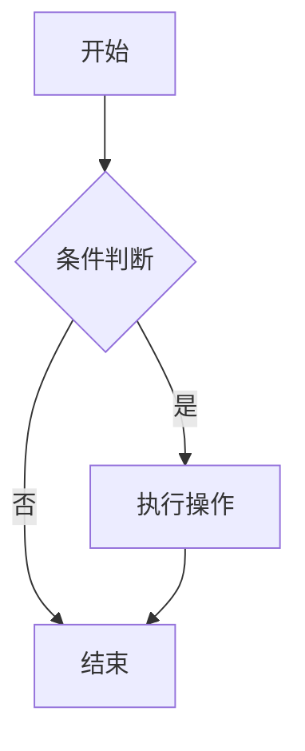

# 必学工具

作为一名 CSer，掌握高效的工具可以极大提升学习和工作效率。本页面介绍了一些必备的工具及其使用方法。

## 🛠️ 开发环境

### 代码编辑器/IDE

#### Visual Studio Code

轻量级但功能强大的代码编辑器，适合大多数开发场景。

**推荐插件**：
- Python
- JavaScript/TypeScript
- GitLens
- Prettier
- ESLint
- Live Server

**快捷键**：
- `Ctrl+P`：快速打开文件
- `Ctrl+Shift+P`：命令面板
- `Ctrl+`：打开终端
- `F12`：跳转到定义

#### JetBrains IDEs

功能全面的集成开发环境，适合大型项目开发。

- **IntelliJ IDEA**：Java 开发
- **PyCharm**：Python 开发
- **WebStorm**：Web 前端开发
- **CLion**：C/C++ 开发

### 版本控制

#### Git

分布式版本控制系统，团队协作必备。

**基本命令**：
```bash
git init                    # 初始化仓库
git add .                   # 添加所有文件到暂存区
git commit -m "提交信息"     # 提交更改
git push origin main        # 推送到远程仓库
git pull origin main        # 从远程仓库拉取
git branch                  # 查看分支
git checkout -b 新分支名    # 创建并切换到新分支
```

**推荐工作流**：
1. 功能开发前创建新分支
2. 定期提交代码，写清晰的提交信息
3. 开发完成后发起 Pull Request
4. 代码审查通过后合并到主分支

#### GitHub

代码托管平台，提供协作开发功能。

**实用功能**：
- Issues：问题跟踪
- Projects：项目管理
- Actions：CI/CD 自动化
- Pages：静态网站托管

---

## 🌐 网络工具

### 浏览器开发者工具

所有现代浏览器都内置了强大的开发者工具。

**常用功能**：
- Elements：查看和修改 DOM/CSS
- Console：JavaScript 调试
- Network：网络请求分析
- Performance：性能分析
- Application：存储、缓存、Service Workers

### API 测试工具

#### Postman

API 开发和测试的强大工具。

**主要功能**：
- 发送各种 HTTP 请求
- 保存请求集合
- 自动化测试
- 生成 API 文档

#### curl

命令行 HTTP 客户端，适合快速测试。

```bash
curl -X GET https://api.example.com/data
curl -X POST -H "Content-Type: application/json" \
     -d '{"name":"John","age":30}' \
     https://api.example.com/users
```

---

## 🐧 命令行工具

### 基础命令

```bash
ls -la                      # 列出文件详情
cd 目录路径                  # 切换目录
mkdir 新目录名               # 创建目录
rm 文件名                   # 删除文件
rm -rf 目录名               # 递归删除目录
cp 源文件 目标文件           # 复制文件
mv 源文件 目标文件           # 移动/重命名文件
cat 文件名                  # 查看文件内容
grep "关键词" 文件名         # 搜索文件内容
```

### 高效工具

#### tmux

终端复用器，可以在一个终端窗口中管理多个会话。

```bash
tmux new -s 会话名          # 创建新会话
tmux ls                     # 列出所有会话
tmux attach -t 会话名        # 连接到会话
tmux kill-session -t 会话名 # 删除会话
```

#### zsh + oh-my-zsh

强大的 Shell 替代方案，提供丰富的插件和主题。

**推荐插件**：
- git：Git 命令别名
- zsh-autosuggestions：自动补全
- zsh-syntax-highlighting：语法高亮

---

## 🐳 容器化

### Docker

容器化平台，简化应用部署和环境管理。

**基本命令**：
```bash
docker build -t 镜像名 .     # 构建镜像
docker run -d -p 8080:80 镜像名  # 运行容器
docker ps                   # 查看运行中的容器
docker logs 容器ID           # 查看容器日志
docker exec -it 容器ID /bin/bash  # 进入容器
docker stop 容器ID           # 停止容器
docker rmi 镜像ID            # 删除镜像
```

**Dockerfile 示例**：
```dockerfile
FROM node:16-alpine
WORKDIR /app
COPY package*.json ./
RUN npm install
COPY . .
EXPOSE 3000
CMD ["npm", "start"]
```

---

## 📝 文档与笔记

### Markdown

轻量级标记语言，适合编写技术文档。

**常用语法**：
```markdown
# 一级标题
## 二级标题

**粗体** *斜体* `代码`

[链接](https://example.com)


- 列表项 1
- 列表项 2

1. 有序列表 1
2. 有序列表 2

```代码块```

| 表头 | 表头 |
|------|------|
| 内容 | 内容 |
```

### 笔记工具

#### Notion

功能强大的笔记和知识管理工具。

**特点**：
- 块编辑器
- 数据库功能
- 模板系统
- 协作功能

#### Obsidian

本地优先的笔记应用，支持双向链接。

**特点**：
- 本地存储
- 双向链接
- 插件生态
- 图谱视图

---

## 📊 数据可视化

### 图表工具

#### Mermaid

使用 Markdown 语法创建图表的工具。



#### D3.js

强大的 JavaScript 数据可视化库。

### 数据分析工具

#### Jupyter Notebook

交互式计算环境，适合数据分析和机器学习。

**特点**：
- 代码与文档结合
- 支持多种编程语言
- 可视化输出
- 易于分享

---

## 🔄 自动化

### 任务管理

#### Make

构建自动化工具，适合管理项目构建流程。

**Makefile 示例**：
```makefile
CC = gcc
CFLAGS = -Wall -g

all: program

program: program.o utils.o
	$(CC) $(CFLAGS) -o program program.o utils.o

program.o: program.c
	$(CC) $(CFLAGS) -c program.c

utils.o: utils.c
	$(CC) $(CFLAGS) -c utils.c

clean:
	rm -f *.o program
```

#### npm scripts

Node.js 项目的任务管理工具。

```json
{
  "scripts": {
    "start": "node server.js",
    "dev": "nodemon server.js",
    "test": "jest",
    "build": "webpack --mode production",
    "lint": "eslint ."
  }
}
```

---

## 🔧 调试工具

### 代码调试

#### GDB

C/C++ 程序调试器。

```bash
gdb 程序名
(gdb) break main              # 设置断点
(gdb) run                     # 运行程序
(gdb) print 变量名             # 打印变量值
(gdb) next                    # 执行下一行
(gdb) continue                # 继续执行
```

#### Chrome DevTools

Web 应用调试工具，支持 JavaScript 调试、性能分析等。

### 性能分析

#### Profiling

分析程序性能瓶颈的工具。

- Python: cProfile, line_profiler
- JavaScript: Chrome Performance Tab
- Java: JProfiler, VisualVM

---

## 📚 学习资源

### 官方文档

- [Git 官方文档](https://git-scm.com/doc)
- [Docker 官方文档](https://docs.docker.com/)
- [VS Code 官方文档](https://code.visualstudio.com/docs)

### 在线教程

- [GitHub Learning Lab](https://lab.github.com/)
- [Docker Curriculum](https://github.com/docker/labs)
- [Web 开发者工具教程](https://developer.chrome.com/docs/devtools/)

---

::: tip 工具学习建议
1. **循序渐进**：不要一次性学习所有工具，根据需要逐步掌握
2. **实践为主**：工具学习重在实践，多动手操作
3. **定制配置**：根据自己的习惯定制工具配置，提高效率
4. **保持更新**：工具更新频繁，关注新功能和最佳实践
:::

::: warning 注意事项
1. **避免工具依赖**：工具是辅助，不要成为工具的奴隶
2. **理解原理**：不仅要会用工具，还要理解其背后的原理
3. **适度配置**：不要过度追求完美的配置，以免浪费时间
:::

掌握这些工具将大大提高你的学习和工作效率，但记住工具只是手段，真正的目标是解决问题和创造价值。